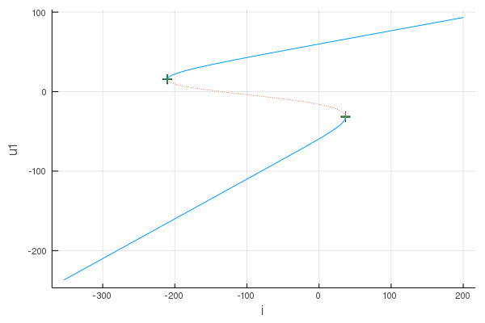
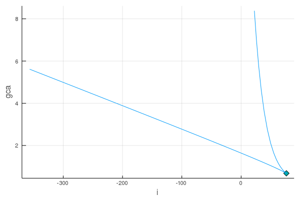

<a id='Calcium-channel-model-1'></a>

# Calcium channel model


Calcium channel model taken from PyDSTool example.  See:


  * [pydstool/Tutorial_Calcium.py at master · robclewley/pydstool](https://github.com/robclewley/pydstool/blob/master/examples/Tutorial_Calcium.py)
  * [Tutorial - PyDSTool Wiki](http://www2.gsu.edu/~matrhc/Tutorial.html)
  * [Bifurcation Analysis · DifferentialEquations.jl](http://docs.juliadiffeq.org/latest/analysis/bifurcation.html)


Use [`QuickTypes.@qstruct_fp`][QuickTypes] to define model parameter:


```julia
using QuickTypes: @qstruct_fp

@qstruct_fp CalciumParam(
    vl = -60,
    vca = 120,
    i = -220.0,
    gl = 2,
    gca = 4,
    c = 20,
    v1 = -1.2,
    v2 = 18,
)
```


Define the model as in [DifferentialEquations.jl][ODEProblem]:


```julia
using Parameters: @unpack

function f(u, p::CalciumParam, t)
    @unpack vl, vca, i, gl, gca, c, v1, v2 = p
    v = u[1]
    w = u[2]
    dv = (i + gl * (vl - v) - gca * 0.5 * (1 + tanh((v-v1)/v2)) * (v-vca)) / c
    dw = v-w
    return SVector(dv, dw)
end
```

```
f (generic function with 1 method)
```


Create an [`ODEProblem`][ODEProblem]:


```julia
using DiffEqBase: ODEProblem
using StaticArrays: SVector

u0 = SVector(-170.0, -170.0)
tspan = (0.0, 30.0)  # ignored by Bifurcations.jl
p = CalciumParam()
ode = ODEProblem(f, u0, tspan, p)
```

```
ODEProblem with uType StaticArrays.SArray{Tuple{2},Float64,1,2} and tType Float64. In-place: false
timespan: (0.0, 30.0)
u0: [-170.0, -170.0]
```


Create a bifurcation problem:


```julia
using Bifurcations: BifurcationProblem
using Setfield: @lens

param_axis = @lens _.i
prob = BifurcationProblem(ode, param_axis, (-300.0, 100.0))
```


Solve it:


```julia
using DiffEqBase: init, solve!

solver = init(prob)
solve!(solver)
sol = solver.sol
```

```
Codim1Solution <Continuous>
# sweeps             : 2
# points             : 106
# branches           : 0
# saddle_node        : 2
```


Plot it:


```julia
using Plots

plt = plot(sol)
```





Find the left Saddle-Node bifurcation point:


```julia
using Bifurcations: special_points

point_list = sort!(special_points(solver), by=p->p.u0[end])
point = point_list[1]
```

```
SpecialPointInterval <Continuous saddle_node>
happened between:
  u0 = [15.36, 15.36, -210.476]
  u1 = [15.822, 15.822, -210.44]
```


Numerical continuation of the Saddle-Node bifurcation point:


```julia
sn_prob = BifurcationProblem(
    point,
    solver,
    (@lens _.gca),
    (0.0, 8.0),
)
sn_solver = init(sn_prob)
solve!(sn_solver)
```

```
Codim2Solver <Continuous>
# sweeps             : 2
# points             : 68
# branches           : 0
# cusp               : 1
```


Plot the phase diagram:


```julia
plt2 = plot(sn_solver.sol)
```





[QuickTypes]: https://github.com/cstjean/QuickTypes.jl


[ODEProblem]: http://docs.juliadiffeq.org/latest/tutorials/ode_example.html

